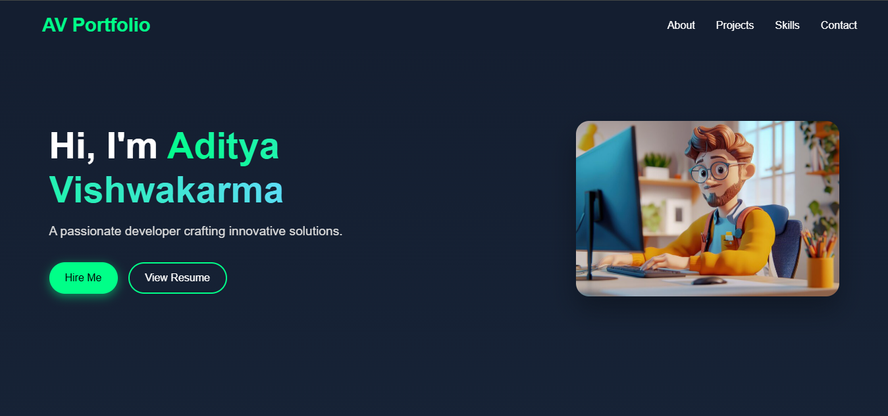

# Aditya Vishwakarma - Portfolio Website

 <!-- Add a screenshot of your portfolio here -->

Welcome to my personal portfolio website! This project showcases my skills, projects, and experience as a developer. Built with **React.js**, **Vite**, and modern web technologies, this portfolio is designed to be **responsive**, **interactive**, and **visually stunning**.

---

## 🚀 Features

- **Modern UI Design**: Clean and professional layout with glassmorphism effects.
- **Interactive Components**: Smooth animations, hover effects, and 3D elements.
- **Responsive Design**: Fully optimized for mobile, tablet, and desktop devices.
- **Dynamic Content**: Sections for About, Projects, Skills, and Contact.
- **Unique Elements**:
  - 3D starry background in the introduction section.
  - Interactive skill bubbles with animations.
  - Floating particles in the footer.
- **SEO Optimized**: Proper meta tags and structured data for better search engine visibility.

---

## 🛠️ Technologies Used

- **Frontend**: React.js, Vite
- **Styling**: CSS3, Framer Motion (for animations)
- **Icons**: React Icons
- **3D Effects**: Three.js, React Three Fiber
- **Deployment**: Vercel / Netlify

---

## 📂 Project Structure

```
portfolio/
├── public/                  # Static assets (images, fonts, etc.)
├── src/
│   ├── assets/              # Images and icons
│   ├── components/          # Reusable components (Navbar, Footer, etc.)
│   ├── styles/              # CSS files for each component
│   ├── App.jsx              # Main application component
│   └── main.jsx             # Entry point
├── .gitignore               # Files to ignore in Git
├── package.json             # Project dependencies
├── README.md                # This file
└── vite.config.js           # Vite configuration
```

---

## 🖥️ Live Demo

Check out the live version of the portfolio:  
👉 [https://aditya-portfolio-np1rpdro0.vercel.app/](https://aditya-portfolio-np1rpdro0.vercel.app/)  <!-- Replace with your actual deployment link -->

---

## 🛠️ Installation

Follow these steps to run the project locally:

1. **Clone the repository**:
   ```bash
   git clone https://github.com/cyberfortify/portfolio.git
   ```

2. **Navigate to the project directory**:
   ```bash
   cd portfolio
   ```

3. **Install dependencies**:
   ```bash
   npm install
   ```

4. **Start the development server**:
   ```bash
   npm run dev
   ```

5. **Open your browser** and visit:
   ```
   http://localhost:3000
   ```

---

## 🎨 Customization

To customize this portfolio for your own use:

1. **Update Personal Information**:
   - Replace the content in the `Introduction`, `About`, `Projects`, and `Skills` sections with your own details.

2. **Add Your Projects**:
   - Update the `projects` array in the `Projects.jsx` file with your own projects.

3. **Change Colors**:
   - Modify the CSS variables in the `styles` folder to match your preferred color scheme.

4. **Deploy**:
   - Deploy the project using Vercel, Netlify, or any other hosting service.

---

## 📄 License

This project is licensed under the **MIT License**. Feel free to use, modify, and distribute it as per the license terms.

---

## 🙏 Acknowledgments

- Inspired by modern web design trends.
- Special thanks to [React](https://reactjs.org), [Vite](https://vitejs.dev), and [Three.js](https://threejs.org) for making this project possible.

---

## 📧 Contact

If you have any questions or feedback, feel free to reach out:  
📧 **Email**: work.aditya2010@gmail.com  
🌐 **Portfolio**: [https://aditya-portfolio-np1rpdro0.vercel.app/](https://aditya-portfolio-np1rpdro0.vercel.app/)  
💼 **LinkedIn**: [Aditya Vishwakarma](https://linkedin.com/in/aditya-vk-professional)  
🐱 **GitHub**: [AdityaVishwakarma](https://github.com/cyberfortify)
